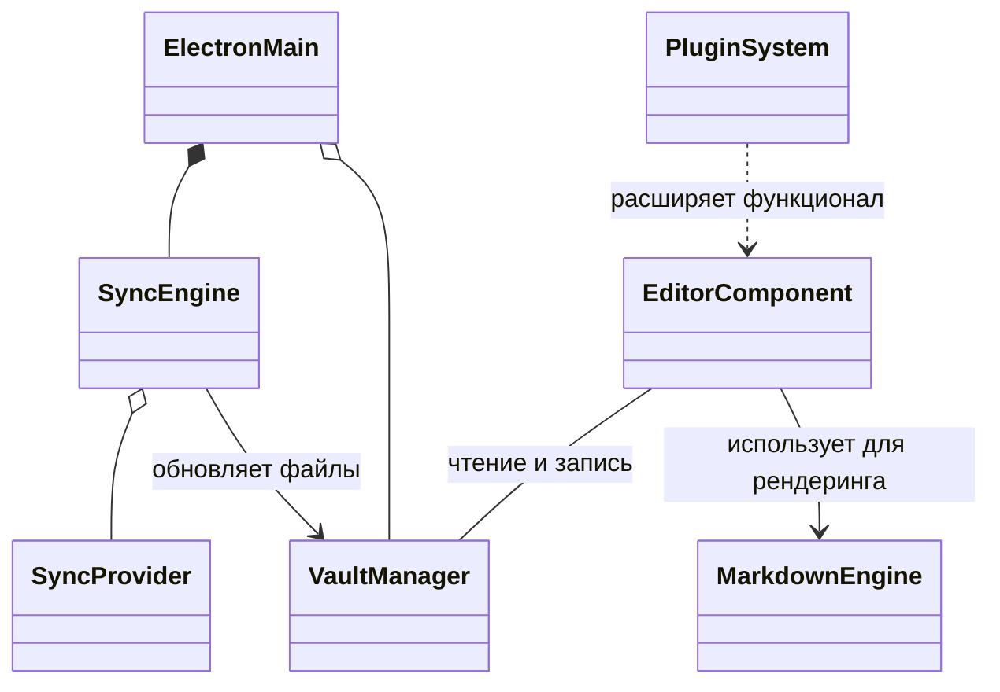

```mermaid
classDiagram
    class ElectronMain
    class SyncEngine
    class SyncProvider
    class VaultManager
    class EditorComponent
    class MarkdownEngine
    class PluginSystem

    %% Композиция: SyncEngine — неотъемлемая часть процесса Main
    ElectronMain *-- SyncEngine
    
    %% Агрегация: Главный процесс управляет хранилищами, но они живут отдельно
    ElectronMain o-- VaultManager

    %% Агрегация: Движок синхронизации содержит набор провайдеров
    SyncEngine o-- SyncProvider

    %% Ассоциация (двусторонняя): Редактор и Хранилище взаимодействуют постоянно
    EditorComponent -- VaultManager : чтение и запись

    %% Однонаправленная ассоциация: Редактор делегирует отрисовку
    EditorComponent --> MarkdownEngine : использует для рендеринга

    %% Однонаправленная ассоциация: Синхронизация меняет содержимое на диске
    SyncEngine --> VaultManager : обновляет файлы

    %% Зависимость: Плагины завязаны на внутреннее API редактора
    PluginSystem ..> EditorComponent : расширяет функционал
```