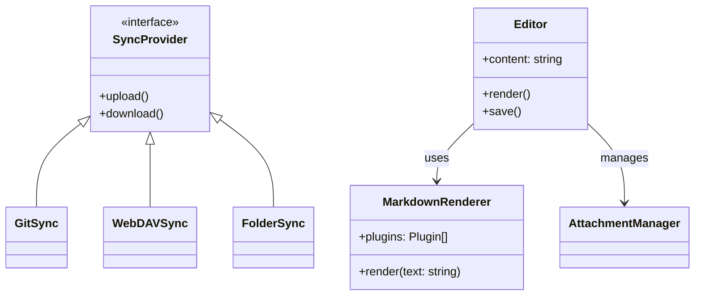

```mermaid
classDiagram
    class SyncProvider {
        <<interface>>
        +upload()
        +download()
    }
    SyncProvider <|-- GitSync
    SyncProvider <|-- WebDAVSync
    SyncProvider <|-- FolderSync

    class Editor {
        +content: string
        +render()
        +save()
    }

    class MarkdownRenderer {
        +plugins: Plugin[]
        +render(text: string)
    }

    Editor --> MarkdownRenderer : uses
    Editor --> AttachmentManager : manages
```